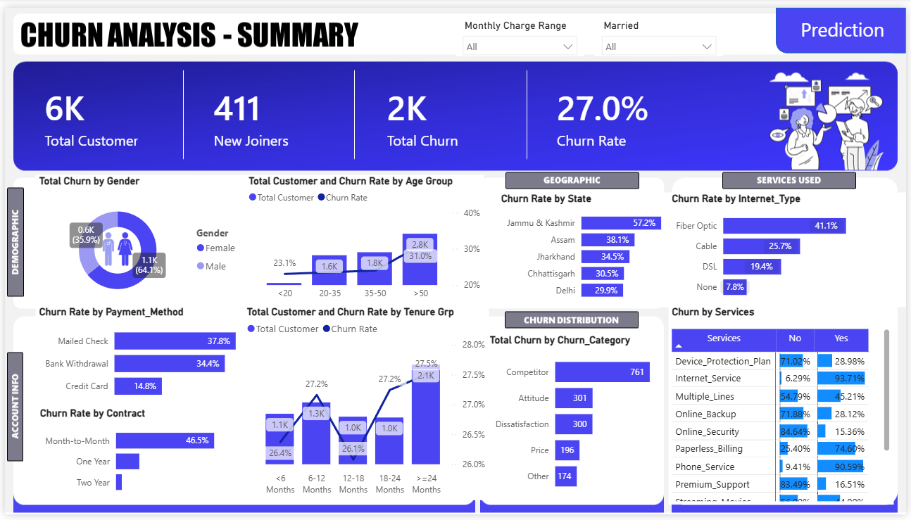
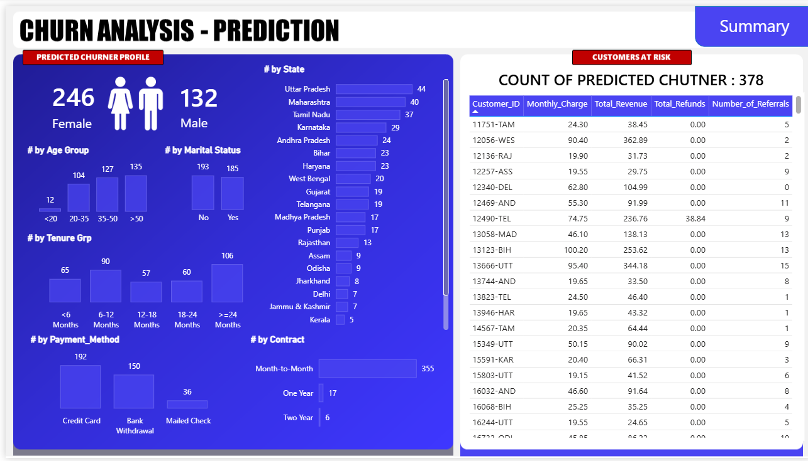
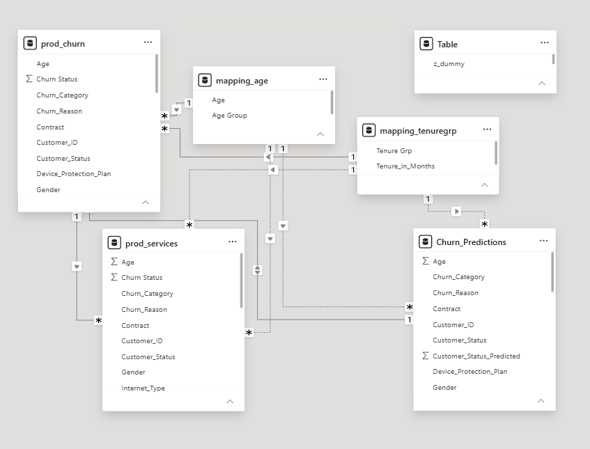

# Customer Churn Analysis & Risk Prediction

An end-to-end **Customer Churn Analysis and Risk Prediction** project combining **MySQL, Python, Machine Learning, Excel, Google Colab, and Power BI** to analyze customer behavior, identify churn patterns, predict customers at risk of churning, and generate actionable customer retention insights.

---

## 📌 Project Overview

This project combines **descriptive, diagnostic, and predictive analytics** into a single customer churn analysis pipeline.

The project is divided into two major stages:

### 1. Churn Analysis

Historical customer data is analyzed to understand churn patterns across:

* Demographics
* Age groups
* States
* Contracts
* Payment methods
* Tenure
* Internet and other services
* Churn categories
* Churn reasons

### 2. Churn Risk Prediction

A **Random Forest Classification** model is trained using customers whose churn outcomes are already known:

* `Stayed`
* `Churned`

The trained model is then applied to newly joined customers whose future churn outcome is unknown.

The predicted high-risk customers are exported to `Predictions.csv` and visualized in a dedicated **Power BI Churn Risk Prediction Dashboard**.

---

## 🛠️ Tech Stack

| Technology         | Purpose                                                                   |
| ------------------ | ------------------------------------------------------------------------- |
| **MySQL**          | Data storage, cleaning, transformation, SQL analysis, and views           |
| **Python**         | Data preprocessing and machine learning                                   |
| **Pandas / NumPy** | Data manipulation and preprocessing                                       |
| **Scikit-learn**   | Label encoding, train/test split, Random Forest, and evaluation           |
| **Joblib**         | Model serialization support                                               |
| **Excel**          | Intermediate data transfer                                                |
| **Google Colab**   | Machine learning execution environment                                    |
| **Power BI**       | Interactive dashboards, KPIs, data modeling, and churn-risk visualization |

---

# 🔄 End-to-End Workflow

```text
Customer_Data.csv
       │
       ▼
     MySQL
       │
       ├── Data Exploration
       ├── Missing-Value Handling
       ├── Data Transformation
       ├── prod_Churn Table
       ├── vw_ChurnData View
       └── vw_JoinData View
       │
       ├──────────────────────┐
       │                      │
       ▼                      ▼
   Power BI             Excel Workbook
 Churn Analysis         churn_predict.xlsx
                              │
                              ▼
                        Google Colab
                              │
                              ├── Preprocessing
                              ├── Label Encoding
                              ├── Train/Test Split
                              ├── Random Forest
                              ├── Model Evaluation
                              └── Feature Importance
                              │
                              ▼
                     Prediction on Joiners
                              │
                              ▼
                       Predictions.csv
                              │
                              ▼
                           Power BI
                              │
                              ▼
                    Churn Risk Dashboard
```

---

# 📂 1. Data Source

The original dataset is:

```text
Customer_Data.csv
```

The dataset contains customer-level information including:

* Customer ID
* Gender
* Age
* Marital Status
* State
* Number of Referrals
* Tenure
* Contract
* Payment Method
* Monthly Charge
* Total Charges
* Total Refunds
* Total Revenue
* Internet and other services
* Customer Status
* Churn Category
* Churn Reason

The original CSV is imported into a MySQL table named:

```text
customer_data
```

---

# 🗄️ 2. MySQL Data Processing

MySQL is used for:

* Database creation
* Data exploration
* Missing-value handling
* Data cleaning
* Data transformation
* Customer segmentation
* SQL analysis
* Creation of analytical views

## Database Initialization

```sql
CREATE DATABASE churn_db;

USE churn_db;
```

---

## 🔍 Exploratory Data Analysis

### Gender Distribution

```sql
SELECT 
    Gender,
    COUNT(Gender) AS TotalCount,
    COUNT(Gender) * 100.00 /
        (SELECT COUNT(*) FROM customer_data) AS Percentage
FROM customer_data
GROUP BY Gender;
```

This determines the number and percentage of customers in each gender category.

### Contract Distribution

```sql
SELECT 
    Contract,
    COUNT(Contract) AS TotalCount,
    COUNT(Contract) * 100.00 /
        (SELECT COUNT(*) FROM customer_data) AS Percentage
FROM customer_data
GROUP BY Contract;
```

This helps understand the distribution of customers across different contract types.

### Customer Status and Revenue

```sql
SELECT 
    Customer_Status,
    COUNT(Customer_Status) AS TotalCount,
    SUM(Total_Revenue) AS TotalRev,
    SUM(Total_Revenue) /
        (SELECT SUM(Total_Revenue) FROM customer_data) * 100
        AS RevPercentage
FROM customer_data
GROUP BY Customer_Status;
```

This analyzes customer status and its contribution to total revenue.

### State Distribution

```sql
SELECT 
    State,
    COUNT(State) AS TotalCount,
    COUNT(State) * 100.00 /
        (SELECT COUNT(*) FROM customer_data) AS Percentage
FROM customer_data
GROUP BY State
ORDER BY Percentage DESC;
```

This identifies the distribution of customers across different states.

---

# 🧹 3. Missing-Value Handling

The dataset may contain blank strings or whitespace instead of proper SQL `NULL` values.

These values are first converted into `NULL` using:

```sql
NULLIF(TRIM(column), '')
```

For example:

```sql
UPDATE customer_data
SET
    Gender = NULLIF(TRIM(Gender), ''),
    Married = NULLIF(TRIM(Married), ''),
    State = NULLIF(TRIM(State), ''),
    Value_Deal = NULLIF(TRIM(Value_Deal), ''),
    Phone_Service = NULLIF(TRIM(Phone_Service), ''),
    Multiple_Lines = NULLIF(TRIM(Multiple_Lines), ''),
    Internet_Service = NULLIF(TRIM(Internet_Service), ''),
    Internet_Type = NULLIF(TRIM(Internet_Type), ''),
    Online_Security = NULLIF(TRIM(Online_Security), ''),
    Online_Backup = NULLIF(TRIM(Online_Backup), ''),
    Device_Protection_Plan = NULLIF(TRIM(Device_Protection_Plan), ''),
    Premium_Support = NULLIF(TRIM(Premium_Support), ''),
    Streaming_TV = NULLIF(TRIM(Streaming_TV), ''),
    Streaming_Movies = NULLIF(TRIM(Streaming_Movies), ''),
    Streaming_Music = NULLIF(TRIM(Streaming_Music), ''),
    Unlimited_Data = NULLIF(TRIM(Unlimited_Data), ''),
    Contract = NULLIF(TRIM(Contract), ''),
    Paperless_Billing = NULLIF(TRIM(Paperless_Billing), ''),
    Payment_Method = NULLIF(TRIM(Payment_Method), ''),
    Customer_Status = NULLIF(TRIM(Customer_Status), ''),
    Churn_Category = NULLIF(TRIM(Churn_Category), ''),
    Churn_Reason = NULLIF(TRIM(Churn_Reason), '');
```

After converting blank values to `NULL`, business-friendly replacements are applied.

| Column                   | Replacement |
| ------------------------ | ----------- |
| `Value_Deal`             | `None`      |
| `Multiple_Lines`         | `No`        |
| `Online_Security`        | `No`        |
| `Online_Backup`          | `No`        |
| `Device_Protection_Plan` | `No`        |
| `Premium_Support`        | `No`        |
| `Streaming_TV`           | `No`        |
| `Streaming_Movies`       | `No`        |
| `Streaming_Music`        | `No`        |
| `Unlimited_Data`         | `No`        |
| `Internet_Type`          | `None`      |
| `Churn_Category`         | `Others`    |
| `Churn_Reason`           | `Others`    |

---

# 🗃️ 4. Creating the `prod_Churn` Table

A cleaned and analysis-ready production table is created from the original dataset.

```sql
CREATE TABLE prod_Churn AS
SELECT
    Customer_ID,
    Gender,
    Age,
    Married,
    State,
    Number_of_Referrals,
    Tenure_in_Months,

    IFNULL(Value_Deal, 'None') AS Value_Deal,

    Phone_Service,

    IFNULL(Multiple_Lines, 'No') AS Multiple_Lines,

    Internet_Service,

    IFNULL(Internet_Type, 'None') AS Internet_Type,
    IFNULL(Online_Security, 'No') AS Online_Security,
    IFNULL(Online_Backup, 'No') AS Online_Backup,
    IFNULL(Device_Protection_Plan, 'No') AS Device_Protection_Plan,
    IFNULL(Premium_Support, 'No') AS Premium_Support,
    IFNULL(Streaming_TV, 'No') AS Streaming_TV,
    IFNULL(Streaming_Movies, 'No') AS Streaming_Movies,
    IFNULL(Streaming_Music, 'No') AS Streaming_Music,
    IFNULL(Unlimited_Data, 'No') AS Unlimited_Data,

    Contract,
    Paperless_Billing,
    Payment_Method,

    Monthly_Charge,
    Total_Charges,
    Total_Refunds,
    Total_Extra_Data_Charges,
    Total_Long_Distance_Charges,
    Total_Revenue,

    Customer_Status,

    IFNULL(Churn_Category, 'Others') AS Churn_Category,
    IFNULL(Churn_Reason, 'Others') AS Churn_Reason

FROM customer_data;
```

The resulting table contains cleaned customer-level information that can be used for analysis and machine learning.

---

# 👁️ 5. SQL Views

Two SQL views are created to separate customers with known outcomes from newly joined customers.

## Historical Churn Data

```sql
CREATE VIEW vw_ChurnData AS
SELECT *
FROM prod_Churn
WHERE Customer_Status IN ('Churned', 'Stayed');
```

`vw_ChurnData` contains customers whose actual churn outcome is known.

These customers are used for model training and evaluation.

---

## New Joiner Data

```sql
CREATE VIEW vw_JoinData AS
SELECT *
FROM prod_Churn
WHERE Customer_Status = 'Joined';
```

`vw_JoinData` contains customers whose future churn outcome is unknown.

These customers are used as prediction candidates.

### Why separate them?

```text
Stayed + Churned
       ↓
Historical Data
       ↓
Model Training
       ↓
Random Forest
       ↓
Predict
       ↓
Joined Customers
```

This prevents the model from using the future outcome of a newly joined customer during prediction.

---

# 📤 6. Data Export

The following datasets are exported from MySQL:

```text
prod_Churn.csv
vw_ChurnData.csv
vw_JoinData.csv
```

The churn and joiner datasets are then combined into:

```text
churn_predict.xlsx
```

The Excel workbook contains:

```text
churn_predict.xlsx
│
├── vw_churndata
└── vw_joindata
```

The workbook is uploaded to **Google Colab** for machine learning.

---

# 🤖 7. Machine Learning

## Model Used

The project uses a:

**Random Forest Classification Model**

```python
rf_model = RandomForestClassifier(
    n_estimators=100,
    random_state=42
)
```

### Why Random Forest?

Random Forest was selected because it:

* Handles multiple customer attributes
* Works well with nonlinear relationships
* Can handle a mixture of numerical and encoded categorical features
* Provides feature-importance values
* Is relatively robust compared with a single decision tree

---

# ⚙️ 8. Data Preprocessing

The following columns are excluded from the model features:

```text
Customer_ID
Churn_Category
Churn_Reason
```

These columns are removed because they are either identifiers or represent information that would not be appropriate as predictive features.

## Categorical Encoding

Categorical variables are converted into numerical values using `LabelEncoder`.

The encoded columns include:

```text
Gender
Married
State
Value_Deal
Phone_Service
Multiple_Lines
Internet_Service
Internet_Type
Online_Security
Online_Backup
Device_Protection_Plan
Premium_Support
Streaming_TV
Streaming_Movies
Streaming_Music
Unlimited_Data
Contract
Paperless_Billing
Payment_Method
```

The target variable is encoded as:

| Customer Status | Encoded Value |
| --------------- | ------------: |
| Stayed          |             0 |
| Churned         |             1 |

---

# 🧪 9. Model Training and Testing

The historical churn dataset is divided into training and testing sets.

```python
X_train, X_test, y_train, y_test = train_test_split(
    X,
    y,
    test_size=0.2,
    random_state=42
)
```

The Random Forest model is then trained:

```python
rf_model.fit(X_train, y_train)
```

Predictions are generated on the test dataset:

```python
y_pred = rf_model.predict(X_test)
```

The model is evaluated using:

* Confusion Matrix
* Classification Report
* Accuracy
* Precision
* Recall
* F1-score
* Feature Importance

> **Note:** Exact performance metrics depend on the dataset and the notebook execution.

---

# 📊 10. Feature Importance

Random Forest provides feature-importance values that can be used to identify which customer attributes have the greatest influence on model predictions.

```python
importances = rf_model.feature_importances_
```

These values are then sorted and visualized.

Feature importance provides an additional layer of model interpretation and helps identify customer characteristics associated with predicted churn risk.

---

# 🔮 11. Churn Risk Prediction

After training, the model is applied to the `vw_JoinData` dataset.

The same encoders fitted on the historical training data are used when transforming the new joiner data.

The model generates:

```text
0 → Not predicted as churned
1 → Predicted as churned
```

A prediction column is added:

```text
Customer_Status_Predicted
```

Only customers predicted as churners are retained for the final output.

```python
original_data = original_data[
    original_data['Customer_Status_Predicted'] == 1
]
```

The resulting dataset is exported as:

```text
Predictions.csv
```

### ⚠️ Important Interpretation

A predicted churner is **not guaranteed to churn**.

The prediction represents a customer who has been identified by the model as having an **elevated predicted risk of churn**.

---

# 📊 12. Power BI Dashboard

Power BI is used to combine the historical churn analysis with machine-learning predictions.

The report contains two major dashboard pages.

---

## A. Churn Analysis — Summary

The Summary dashboard provides an overview of customer churn.

### Key KPIs

* Total Customers
* New Joiners
* Total Churn
* Churn Rate

### Analysis Areas

The dashboard analyzes churn across:

* Gender
* Age Group
* State
* Internet Type
* Payment Method
* Contract
* Tenure Group
* Churn Category
* Individual Services

### Filters

Interactive filters include:

* Monthly Charge Range
* Married Status

### Key Business Questions

The dashboard helps answer:

* What is the overall churn rate?
* How many customers have churned?
* Which age groups have higher churn?
* Which states have higher churn rates?
* Which contracts are associated with higher churn?
* Which payment methods have higher churn?
* Which services are associated with churn?
* What are the major churn categories?

---

## B. Churn Analysis — Prediction

The Prediction dashboard focuses on customers identified by the Random Forest model as potential churn risks.

### Prediction KPIs and Analysis

The dashboard provides:

* Total Predicted Churners
* Predicted Churners by Gender
* Predicted Churners by Age Group
* Predicted Churners by Marital Status
* Predicted Churners by Tenure Group
* Predicted Churners by Payment Method
* Predicted Churners by Contract
* Predicted Churners by State

### Customer-Level Risk Table

The dashboard also provides customer-level information such as:

* Customer ID
* Monthly Charge
* Total Revenue
* Total Refunds
* Number of Referrals

This allows the analysis to move from overall churn trends to **individual customers who may require retention attention**.

---

# 🔗 13. Power BI Data Model

The Power BI model contains the following major tables:

```text
prod_Churn
prod_services
Churn_Predictions
mapping_age
mapping_tenuregrp
z_dummy
```

### `prod_Churn`

Contains cleaned customer-level information.

### `prod_services`

Contains service-related customer information used for service-level analysis.

### `mapping_age`

Maps individual ages into groups:

| Age     | Age Group |
| ------- | --------- |
| `<20`   | Under 20  |
| `20-35` | 20–35     |
| `35-50` | 35–50     |
| `>50`   | Above 50  |

### `mapping_tenuregrp`

Maps customer tenure into groups:

| Tenure         | Group          |
| -------------- | -------------- |
| `<6 Months`    | Under 6 Months |
| `6-12 Months`  | 6–12 Months    |
| `12-18 Months` | 12–18 Months   |
| `18-24 Months` | 18–24 Months   |
| `>=24 Months`  | 24+ Months     |

### `Churn_Predictions`

Contains machine-learning predictions and customer information used by the Prediction dashboard.

### `z_dummy`

Supporting table used within the Power BI data model.

---

# 💼 14. Business Value

This project combines three levels of analytics.

## Descriptive Analytics — What Happened?

Power BI provides historical churn insights across:

* Demographics
* Contracts
* Payment methods
* Tenure
* Services
* States

## Diagnostic Analytics — Why Might It Have Happened?

Customer attributes, churn categories, and churn reasons help investigate potential drivers of customer churn.

## Predictive Analytics — What Could Happen?

The Random Forest model identifies newly joined customers who are predicted to have a higher risk of churn.

## Business Action — What Can Be Done?

The predicted customer list can support:

* Prioritization of high-risk customers
* Targeted retention campaigns
* Contract-level retention strategies
* Investigation of service dissatisfaction
* Customer-specific interventions
* Monitoring of high-risk customer segments

---

# 📂 15. GitHub Repository Structure

```text
Customer-Churn-Analysis-and-Prediction-Dashboard/
│
├── Images/
│   ├── Summary(Dashboard).png
│   ├── Prediction_Dashboard.png
│   └── PowerBI_Data_Model.png
│
├── Raw Data/
│   ├── Customer_Data.csv
│   ├── prod_Churn.csv
│   ├── vw_ChurnData.csv
│   ├── vw_JoinData.csv
│   ├── churn_predict.xlsx
│   └── Predictions.csv
│
├── DataCleaning.sql
│
├── RandomForestClassifier.py
│
└── README.md
```

### Repository Components

**`Images/`**
Contains screenshots of the Power BI dashboards and data model.

**`Raw Data/`**
Contains the source, processed, and prediction datasets used throughout the project.

**`DataCleaning.sql`**
Contains the complete MySQL workflow, including database initialization, data exploration, missing-value handling, data transformation, creation of `prod_Churn`, and creation of analytical views.

**`RandomForestClassifier.py`**
Contains the machine-learning workflow, including preprocessing, categorical encoding, train/test splitting, Random Forest training, evaluation, feature importance, and churn-risk prediction.

**`README.md`**
Contains the complete project documentation, workflow, methodology, dashboards, and reproduction instructions.

---

# 🚀 16. How to Run the Project

## Step 1 — Import the CSV into MySQL

Import:

```text
Customer_Data.csv
```

into a MySQL table named:

```text
customer_data
```

---

## Step 2 — Run the SQL Script

Execute:

```text
DataCleaning.sql
```

The script performs:

1. Database creation
2. Data exploration
3. Missing-value checks
4. Blank-to-NULL conversion
5. Missing-value replacement
6. Creation of `prod_Churn`
7. Creation of `vw_ChurnData`
8. Creation of `vw_JoinData`

---

## Step 3 — Export the Processed Data

Export:

```text
prod_Churn.csv
vw_ChurnData.csv
vw_JoinData.csv
```

Prepare the Excel workbook:

```text
churn_predict.xlsx
```

with the following sheets:

```text
vw_churndata
vw_joindata
```

---

## Step 4 — Run the Machine-Learning Workflow

Open:

```text
RandomForestClassifier.py
```

in Google Colab.

Update the Excel file path:

```python
file_path = r"<file-path>/churn_predict.xlsx"
```

Then run the workflow to:

1. Load historical churn data
2. Preprocess the dataset
3. Encode categorical variables
4. Split the data into training and testing sets
5. Train the Random Forest model
6. Evaluate the model
7. Generate feature importance
8. Load new joiner data
9. Apply the trained encoders
10. Predict churn risk
11. Generate `Predictions.csv`

---

## Step 5 — Build the Power BI Dashboard

Import the required processed datasets and:

```text
Predictions.csv
```

into Power BI.

Create the required relationships and mapping tables.

The final report provides:

```text
Historical Churn Analysis
          +
Predictive Churn Risk
          ↓
Customer Retention Insights
```

---

# ⭐ 17. Key Project Highlights

* Built an end-to-end **Customer Churn Analysis and Prediction** pipeline.
* Used **MySQL** for data cleaning, transformation, exploration, and analytical views.
* Converted blank text values into proper SQL `NULL` values.
* Replaced missing categorical values with meaningful business categories such as `None`, `No`, and `Others`.
* Created separate SQL views for historical customers and newly joined customers.
* Used **Random Forest Classification** for churn-risk prediction.
* Applied consistent categorical encoding between training and prediction datasets.
* Evaluated the model using a confusion matrix and classification report.
* Used Random Forest feature importance for model interpretation.
* Generated a customer-level `Predictions.csv`.
* Built interactive Power BI dashboards for both historical churn analysis and predictive churn risk.
* Connected **SQL + Machine Learning + Business Intelligence** into a single end-to-end workflow.
* Translated model predictions into customer-level retention insights.

---

# 🖼️ 18. Dashboard Screenshots

## Churn Analysis — Summary



## Churn Analysis — Prediction



## Power BI Data Model



---

# ⚠️ 19. Important Notes

* The model is trained only on customers with known outcomes: `Stayed` and `Churned`.
* `Joined` customers are treated as prediction candidates.
* The future churn outcome of a joined customer is not used during prediction.
* The same categorical encoders fitted on the training data are used for prediction data.
* Exact model performance depends on the dataset and notebook execution.
* `Predictions.csv` contains model predictions, not confirmed future churn outcomes.
* A predicted churner should be interpreted as a customer with **elevated predicted churn risk**, not as a guaranteed future churner.

---

# 🏁 20. Conclusion

This project demonstrates a complete **Data Analytics + Machine Learning + Business Intelligence** workflow:

```text
Raw Customer Data
       ↓
MySQL Data Cleaning
       ↓
SQL Analysis & Views
       ↓
Python Preprocessing
       ↓
Random Forest Classification
       ↓
Churn Risk Prediction
       ↓
Predictions.csv
       ↓
Power BI
       ↓
Actionable Customer Retention Insights
```

By combining **SQL-based data preparation, machine learning, and Power BI visualization**, the project moves beyond simply analyzing historical churn.

It provides both:

* **Historical insights** into why customers churn
* **Predictive insights** into which newly joined customers may be at higher risk

This creates a practical analytics workflow that can help businesses prioritize retention efforts and make more data-driven customer decisions.
